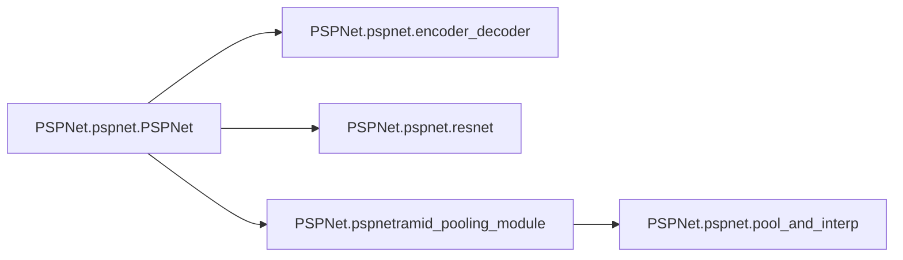

# Pspnet Pspnet

[_Documentation generated by Documatic_](https://www.documatic.com)

<!---Documatic-section-Codebase Structure-start--->
## Codebase Structure

<!---Documatic-block-system_architecture-start--->
```mermaid
None
```
<!---Documatic-block-system_architecture-end--->

# #
<!---Documatic-section-Codebase Structure-end--->

<!---Documatic-section-PSPNet.pspnet.resnet-start--->
## PSPNet.pspnet.resnet

<!---Documatic-section-resnet-start--->
<!---Documatic-block-PSPNet.pspnet.resnet-start--->
<details>
	<summary><code>PSPNet.pspnet.resnet</code> code snippet</summary>

```python
def resnet(x, input_shape):
    x = ResNet50(include_top=False, weights=None, input_tensor=x, input_shape=(512, 512, 3)).output
    x = UpSampling2D(size=(2, 2))(x)
    x = UpSampling2D(size=(2, 2))(x)
    x = UpSampling2D(size=(2, 2))(x)
    return x
```
</details>
<!---Documatic-block-PSPNet.pspnet.resnet-end--->
<!---Documatic-section-resnet-end--->

# #
<!---Documatic-section-PSPNet.pspnet.resnet-end--->

<!---Documatic-section-PSPNet.pspnet.encoder_decoder-start--->
## PSPNet.pspnet.encoder_decoder

<!---Documatic-section-encoder_decoder-start--->
<!---Documatic-block-PSPNet.pspnet.encoder_decoder-start--->
<details>
	<summary><code>PSPNet.pspnet.encoder_decoder</code> code snippet</summary>

```python
def encoder_decoder(inp):
    ed_conv1 = Conv2D(16, 3, activation='relu', padding='same')(inp)
    bn1 = BatchNormalization()(ed_conv1)
    pool1 = MaxPooling2D()(bn1)
    ed_conv2 = Conv2D(64, 3, activation='relu', padding='same')(pool1)
    bn2 = BatchNormalization()(ed_conv2)
    pool2 = MaxPooling2D()(bn2)
    up1 = Conv2D(16, 3, activation='relu', padding='same')(UpSampling2D(size=(2, 2))(pool2))
    bn3 = BatchNormalization()(up1)
    up2 = Conv2D(3, 3, activation='relu', padding='same')(UpSampling2D(size=(2, 2))(bn3))
    bn4 = BatchNormalization()(up2)
    return bn4
```
</details>
<!---Documatic-block-PSPNet.pspnet.encoder_decoder-end--->
<!---Documatic-section-encoder_decoder-end--->

# #
<!---Documatic-section-PSPNet.pspnet.encoder_decoder-end--->

<!---Documatic-section-PSPNet.pspnet.interpolation-start--->
## PSPNet.pspnet.interpolation

<!---Documatic-section-interpolation-start--->
<!---Documatic-block-PSPNet.pspnet.interpolation-start--->
<details>
	<summary><code>PSPNet.pspnet.interpolation</code> code snippet</summary>

```python
def interpolation(x, shape):
    (h_to, w_to) = shape
    resized = tf.image.resize_images(x, [h_to, w_to], align_corners=True)
    return resized
```
</details>
<!---Documatic-block-PSPNet.pspnet.interpolation-end--->
<!---Documatic-section-interpolation-end--->

# #
<!---Documatic-section-PSPNet.pspnet.interpolation-end--->

<!---Documatic-section-PSPNet.pspnet.pool_and_interp-start--->
## PSPNet.pspnet.pool_and_interp

<!---Documatic-section-pool_and_interp-start--->
<!---Documatic-block-PSPNet.pspnet.pool_and_interp-start--->
<details>
	<summary><code>PSPNet.pspnet.pool_and_interp</code> code snippet</summary>

```python
def pool_and_interp(res, level, feature_map_shape):
    kernel_strides_dict = {1: 30, 2: 15, 3: 10, 6: 5}
    kernel = (kernel_strides_dict[level], kernel_strides_dict[level])
    strides = (kernel_strides_dict[level], kernel_strides_dict[level])
    x = AveragePooling2D(kernel, strides=strides)(res)
    x = Conv2D(512, (1, 1), strides=(1, 1))(x)
    x = BatchNormalization()(x)
    x = Activation('relu')(x)
    x = Lambda(interpolation, arguments={'shape': feature_map_shape})(x)
    return x
```
</details>
<!---Documatic-block-PSPNet.pspnet.pool_and_interp-end--->
<!---Documatic-section-pool_and_interp-end--->

# #
<!---Documatic-section-PSPNet.pspnet.pool_and_interp-end--->

<!---Documatic-section-PSPNet.pspnet.pyramid_pooling_module-start--->
## PSPNet.pspnet.pyramid_pooling_module

<!---Documatic-section-pyramid_pooling_module-start--->
<!---Documatic-block-PSPNet.pspnet.pyramid_pooling_module-start--->
<details>
	<summary><code>PSPNet.pspnet.pyramid_pooling_module</code> code snippet</summary>

```python
def pyramid_pooling_module(res):
    resnet_out_shape = K.int_shape(res)
    feature_map_shape = (resnet_out_shape[1], resnet_out_shape[2])
    pool_and_interp1 = pool_and_interp(res, 1, feature_map_shape)
    pool_and_interp2 = pool_and_interp(res, 2, feature_map_shape)
    pool_and_interp3 = pool_and_interp(res, 3, feature_map_shape)
    pool_and_interp6 = pool_and_interp(res, 6, feature_map_shape)
    concat = Concatenate()([res, pool_and_interp6, pool_and_interp3, pool_and_interp2, pool_and_interp1])
    return concat
```
</details>
<!---Documatic-block-PSPNet.pspnet.pyramid_pooling_module-end--->
<!---Documatic-section-pyramid_pooling_module-end--->

# #
<!---Documatic-section-PSPNet.pspnet.pyramid_pooling_module-end--->

<!---Documatic-section-PSPNet.pspnet.PSPNet-start--->
## PSPNet.pspnet.PSPNet

<!---Documatic-section-PSPNet-start--->


### Object Calls

* PSPNet.pspnet.encoder_decoder
* PSPNet.pspnet.resnet
* PSPNet.pspnetramid_pooling_module

<!---Documatic-block-PSPNet.pspnet.PSPNet-start--->
<details>
	<summary><code>PSPNet.pspnet.PSPNet</code> code snippet</summary>

```python
def PSPNet(n_classes=3, input_shape=(128, 128, 4)):
    inputs = Input(input_shape)
    'in_shape = inputs.shape\n    out_shape = (in_shape[1], in_shape[2], 3)'
    res_input = encoder_decoder(inputs)
    res_input_shape = K.int_shape(res_input)
    res_input_shape = (res_input_shape[1], res_input_shape[2], res_input_shape[3])
    res = resnet(res_input, input_shape=res_input_shape)
    ppmodule_out = pyramid_pooling_module(res)
    x = Conv2D(512, 3, activation='relu', padding='same')(ppmodule_out)
    x = BatchNormalization()(x)
    x = Dropout(0.5)(x)
    x = Conv2D(n_classes, 1)(x)
    x = Lambda(interpolation, arguments={'shape': (input_shape[0], input_shape[1])})(x)
    out = Activation('softmax')(x)
    model = Model(inputs=inputs, outputs=out)
    adam = Adam(lr=1e-05)
    model.compile(optimizer=adam, loss='categorical_crossentropy', metrics=['accuracy'])
    model.summary()
    return model
```
</details>
<!---Documatic-block-PSPNet.pspnet.PSPNet-end--->
<!---Documatic-section-PSPNet-end--->

# #
<!---Documatic-section-PSPNet.pspnet.PSPNet-end--->

[_Documentation generated by Documatic_](https://www.documatic.com)